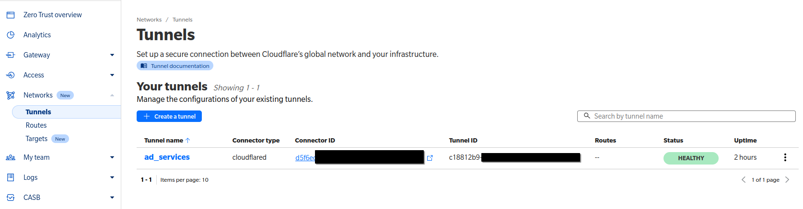

# Face recognition backend

Python backend face identifiying service built off [DeepFace](https://github.com/serengil/deepface) to recognize faces and FastAPI as an API hosting service.

Used in conjunction with [this frontend](https://github.com/seanntxj/lucky_draw_check_in_app).

# Quickstart with Python only for local testing

1. Install Python dependencies in a virtual environment.
   `python -m venv venv`
   `venv\Scripts\activate` if on Windows
   `pip install -r requirements.txt`
2. Create a folder called `faces` in the same directory as this README.md file.
3. Populate the folder with faces, folders containing IDs and names in this exact format: `<ID>+<Name>`.
   *You may use multiple images of the same person or less. Naming within doesn't matter.*

   
4. Run  `python realtimedemo.py`
   A window will show with a livefeed of your webcam. Point your webcam at a face which is in the folder "faces" should result in the folder name showing.
5. If there's an error for downloading the weights, manually get `retinaface` and `facenet512` from [here](https://github.com/serengil/deepface_models/releases/tag/v1.0). Place into `C:\Users\<YOURPCUSERNAME>\.deepface\weights`.

# Production setup

For use in combination with the [lucky_draw_check_in_app](https://github.com/seanntxj/lucky_draw_check_in_app) frontend.

## Local device set-up 
Setup for use if the frontend and face scanning backend service are being run on the same machine. Please follow through all steps here even if you're planning to use a cloud-based or local network solution.

### 1. Creating embeddings

- Populate the folder "faces" as per the instructions in the quickstart.
- Run `python create_embeddings.py`.

The error `ValueError: Face could not be detected in numpy array.Please confirm that the picture is a face photo or consider to set enforce_detection param to False.` may be ignored. However, if `🔴 Exception while extracting faces from` is seen, it means a face can't be detected in that particular photo.
- Copy the folder model inside `faces` to `app/model`. You are not required to have all the images alongside the model in the production environment.
  

### 2. Starting the server

To start the server for use with the React + Vite frontend, run `python app/src/face_api.py`. By default it'll occupy port `9001`.

### 3. Test connection with front end
Using the front end app, insert the link `http://localhost:9001/check-face` into the Settings page and test.

## Local network set-up

### 1. Obtain an SSL certificate
Either generate or use an already obtained SSL certificate. Generation can be done with OpenSSL if installed `openssl req -x509 -nodes -days 365 -newkey rsa:2048 -keyout cert.key -out cert.crt`.

Place the `key` and `crt` files in `app/https_certs`

This is required to avoid a scenario where browsers block outgoing HTTP traffic. 

### 2. Run the HTTPS flask server
Use `python app/src/face_api_https.py`.

### 3. Visit the API endpoint on a browser
Using another device connected on the same local area network, connect to the local area network IP address shown by flask. In my case, it was the second IP address.

You will likely see a security warning, just proceed to the address.

After allowing the browser should show this.

And on the host machine, the console should show a successful connection.

### 4. Testing the API endpoint on the front end app
Place the API link into the Settings page of the front end app and test.

## CloudFlare setup

### 1. Install the CloudFlared connector. 

### 2. Login with CloudFlared with 
`cloudflared login`

### 3. Activate the service tunnel 

### 4. Ensure connectivity 
Either use the command line:

Or check on the CloudFlare Admin portal: 

## CloudFlare cleanup

### 1. Stop the cloudflared Service

Since we've installed it as a service, we need to stop it using our system's service manager.
On Systemd-based Systems (e.g., Arch Linux):

Run the following command:

`sudo systemctl stop cloudflared`

This will stop the cloudflared service and, consequently, any active tunnels.
### 2. Disable the Service (Optional)

If you don’t want the service to restart on boot:

`sudo systemctl disable cloudflared`

### 3. Check the Status

To confirm that the service and tunnel are stopped:

`sudo systemctl status cloudflared`

It should show that the service is inactive or stopped.
### 4. Uninstall the Service (Optional)

If you no longer need the cloudflared service and want to clean up:

`sudo cloudflared service uninstall`

This will remove the service configuration but will not delete cloudflared itself.

# Troubleshooting

- **ERR_CERT_AUTHORITY_INVALID error when using the frontend**
You have skipped or need to retry step 3.

- **I'm using Windows as the host machine, and cannot connect to it**
You need to allow the ports `9001` (or if you changed it whatever you used) through `Windows Defender Firewall with Advanced Security`

## Docker

### Docker testing locally

1. **Prepare files**
   - Place the vectorized `.pkl` created from `create_embeddings.py` into `app/model` folder.
   - Download weights `retinaface.h5` and `facenet512_weights.h5` from [here](https://github.com/serengil/deepface_models/releases/tag/v1.0) into `app/.deepface/weights`
     
2. **Build the docker image**
   `docker build -t fastapi:initial .`
3. **Run the docker image locally**
   `docker run -d --name fastapi-server -p 9001:9001 fastapi:initial`

### Deploying Dockerized server onto Cloud Foundry

0. **Login to Docker Hub**
   `docker login -u <DockerHubUsername> -p <DockerHubPassword>`
1. **Tag the local docker image with your Docker Hub username**
   `docker tag fastapi:initial <DockerHubUsername>/fastapi:initial`
2. **Push the image to Docker Hub**
   `docker push <DockerHubUsername>/fastapi:initial`
